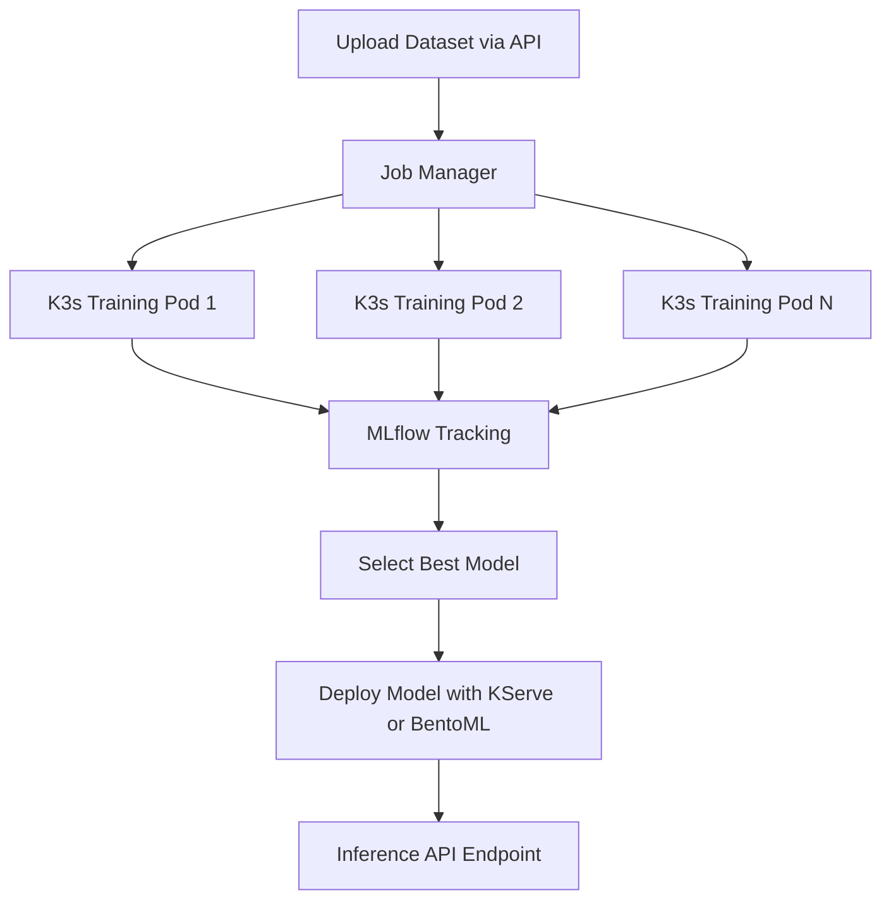
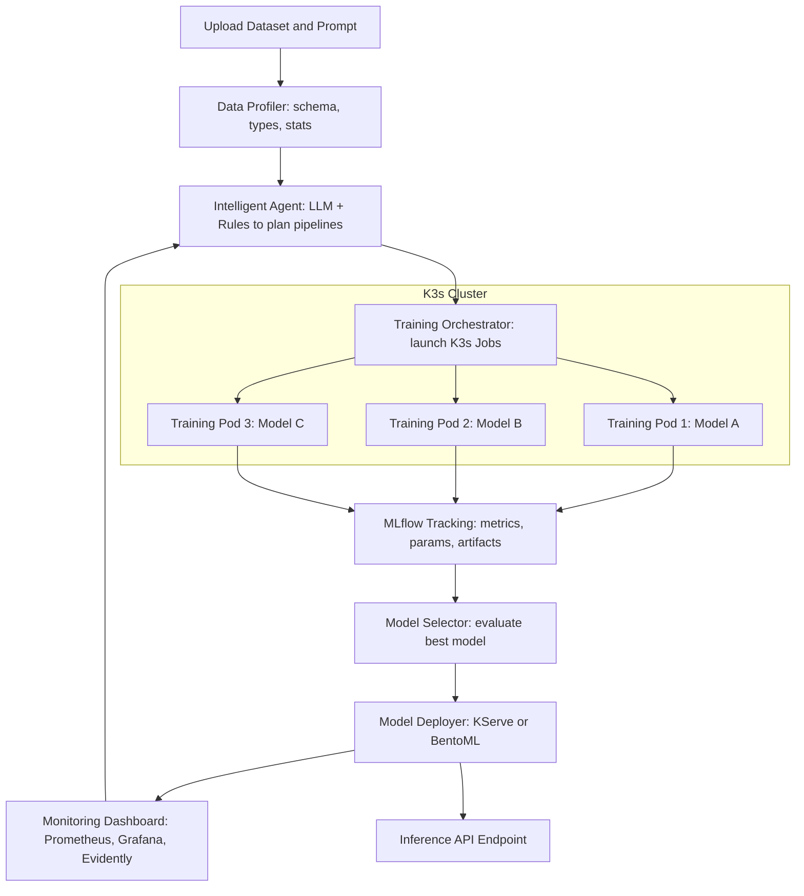

# AutoML-Platform
This project is a AutoML Platform that allows a user to have quick model and a deployed ready for inference model

## Requirements

Before running the project, ensure you have the following installed:

- **uv** - Python package manager (https://github.com/astral-sh/uv)
- **Node.js & npm** - For the Next.js dashboard
- **Redis** - Message queue for job management (run: `docker run -d -p 6379:6379 redis`)
- **Minikube** - Local Kubernetes cluster
- **kubectl** - Kubernetes command-line tool

## Project Setup

Install Python dependencies:
```bash
uv sync
```

## Running the Platform

The platform can be started using the launcher script:

```bash
./launcher.sh
```

This will start all services:
- **MLflow Server** - Model tracking and registry (http://localhost:5001)
- **API Server** - FastAPI backend (http://localhost:8000)
- **Job Worker** - Background worker for training orchestration
- **Dashboard** - Next.js frontend (http://localhost:3000)

To stop all services:
```bash
./launcher.sh --stop
```

### Environment Variables

Optional configuration:
- `IP_ADDR` - Host IP address for K3s pods to connect to MLflow (auto-detected if not set)
- `DASHBOARD_PORT` - Dashboard port (default: 3000)
- `NEXT_PUBLIC_API_BASE_URL` - API base URL (default: http://localhost:8000)
- `REDIS_HOST` - Redis host (default: localhost)
- `REDIS_PORT` - Redis port (default: 6379)

**Note:** The `IP_ADDR` is automatically detected (macOS: en0 interface, Linux: default route). You can override it by setting it manually if needed:
```bash
export IP_ADDR=192.168.1.100
./launcher.sh
```

# First MVP

With the first MVP we have the following workflow:


# Final MVP
The ultimate goal would be to be able to have the following working architecture

